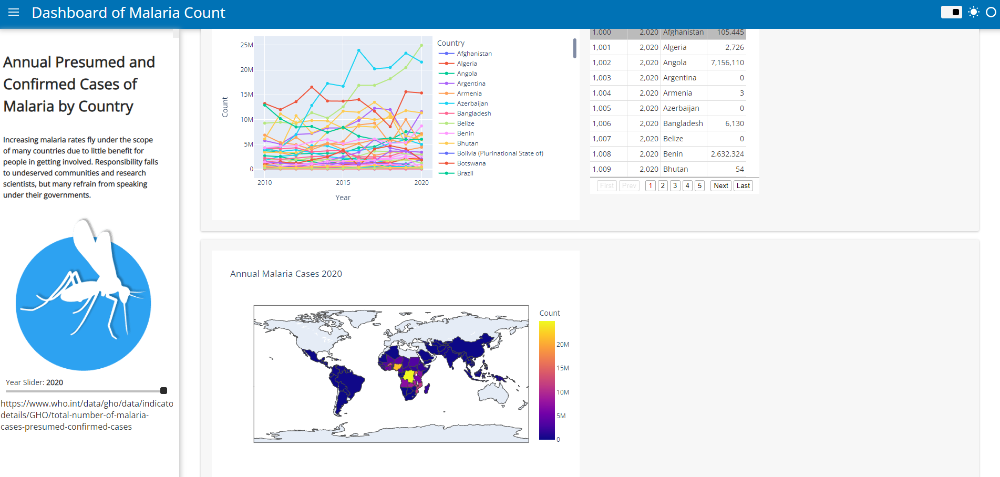

# Dashboard of Annual Presumed and Confirmed Malaria Cases

This app requires panel, which can be installed by typing
`pip3 install panel` 
from the command prompt.

It also has a virtual environment.  On Windows cmd, activate it with the following
`Scripts\activate`
then install dependencies with 
`pip3 install -r requirements.txt`

## malaria_rates.ipynb
This program opens with
`panel serve index.ipynb`

When done, deactivate the venv with 
`deactivate`
or
`Scripts\deactivate`

#### An alarming millions of malaria cases are reported annually and counting.  This interactive dashboard maps cases in the central region with time.  My inspiration for picking this dataset came from reading _The Malaria Capiliaries_ by Robert S. Desowitz.

#### Resource https://www.who.int/data/gho/data/indicators/indicator-details/GHO/total-number-of-malaria-cases-presumed-confirmed-cases